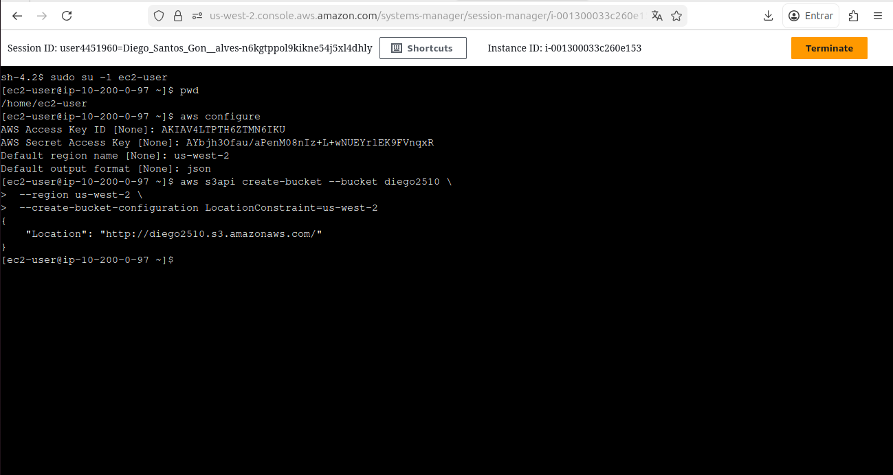
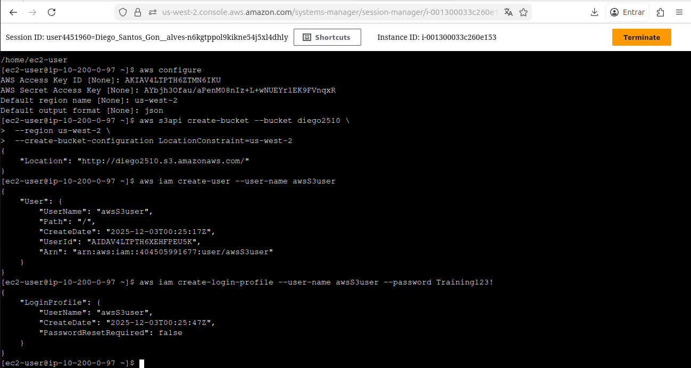
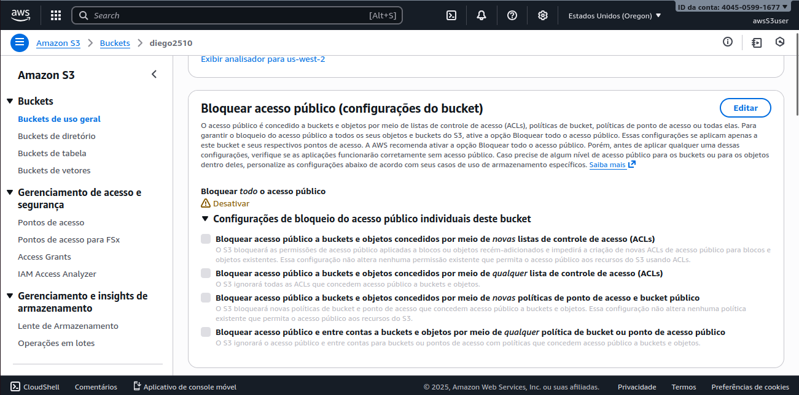
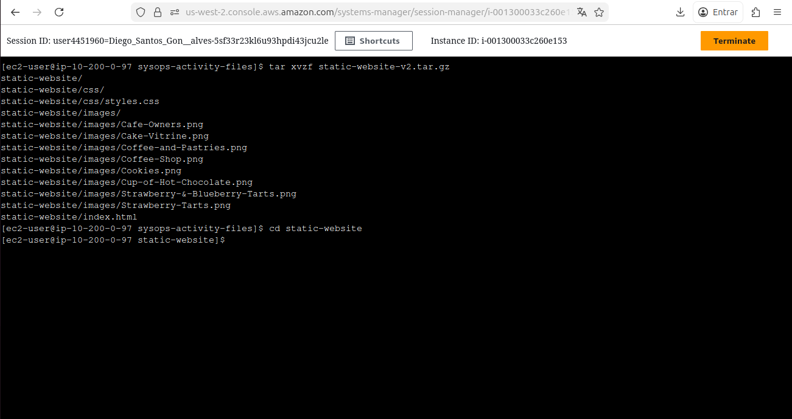
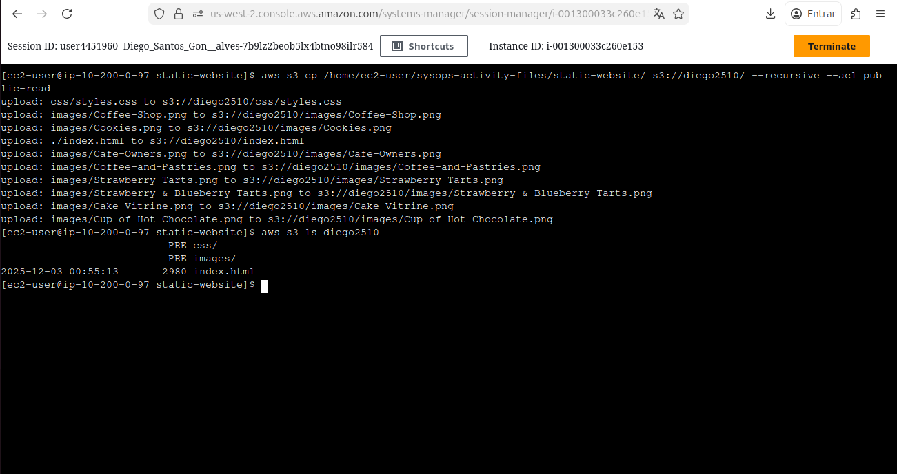
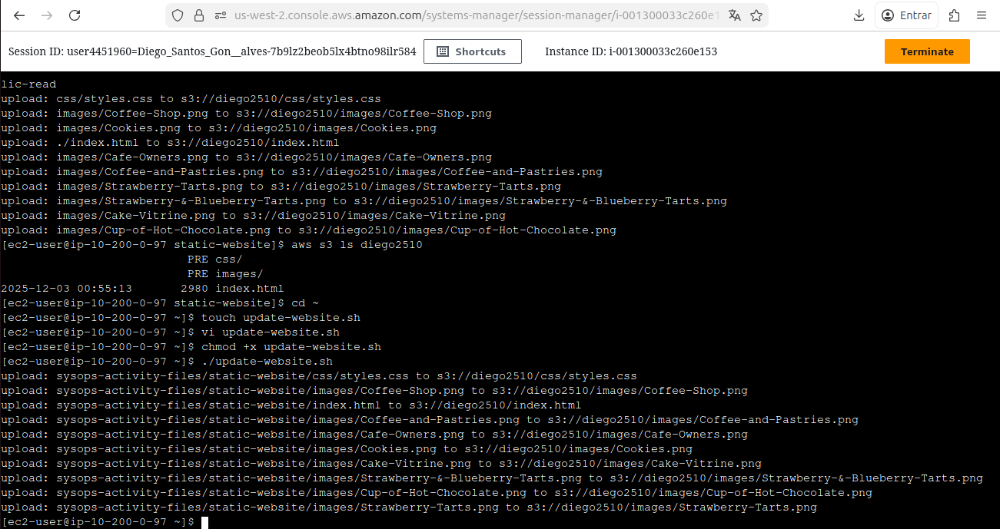
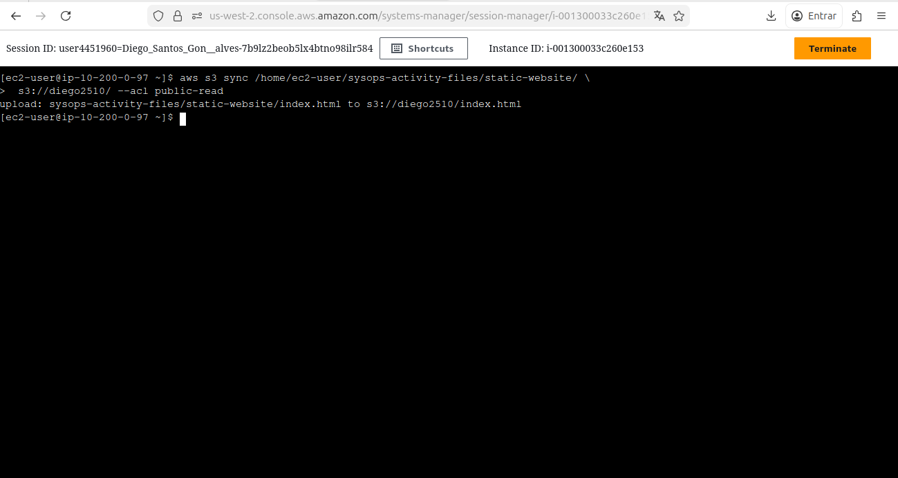
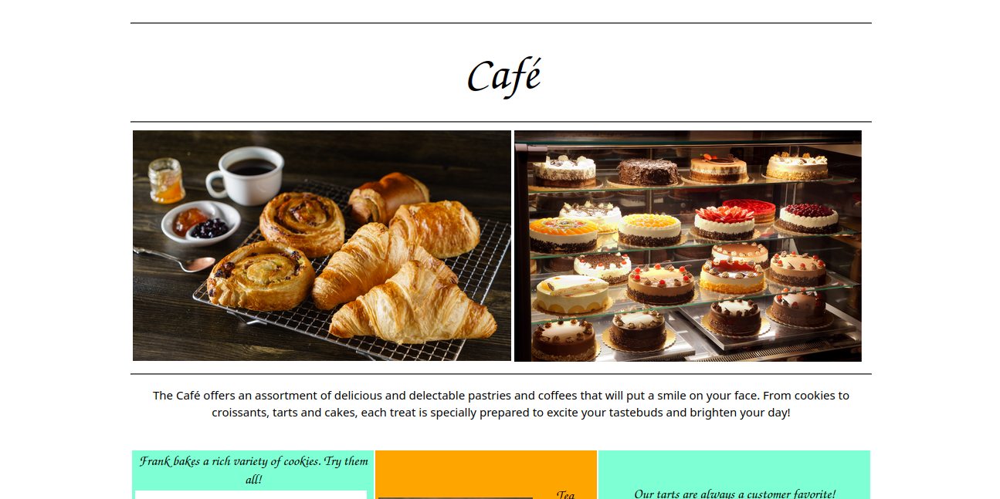

# 🪣 Documentação: Hospedagem de Website Estático no Amazon S3 via AWS CLI

Este repositório documenta o processo de criação e publicação de um **website estático** hospedado no **Amazon S3**, utilizando comandos do **AWS CLI** executados a partir de uma instância **Amazon EC2** em ambiente Linux.
Atividade realizada durante o programa **AWS re/Start – Escola da Nuvem**.

---

## 🧠 Habilidades Adquiridas

* Criação e gerenciamento de buckets no Amazon S3 via CLI
* Criação de usuário IAM com permissões e políticas
* Publicação de site estático no S3 com ACL pública
* Configuração de hosting e endpoint público
* Automação de deploy com script Bash
* Uso de comandos `aws s3 cp` e `aws s3 sync`

---

## 🛠️ Tecnologias Utilizadas

<div align="left">

  
  
  
  
  

</div>

---

## 📁 Estrutura do Repositório

```
s3-static-website-lab/
├── imagens/
├── README.md
└── update-website.sh
```

---

# 🚀 Etapas do Laboratório

---

## 1️⃣ Conexão à Instância EC2 via AWS Systems Manager (SSM)

Conectei-me à instância Amazon Linux via Session Manager e alterei para o usuário `ec2-user`.

🖥️ Comandos executados:

```bash
sudo su -l ec2-user
pwd
```


---

## 2️⃣ Configuração do AWS CLI

Configurei as credenciais temporárias, região e formato de saída:

```bash
aws configure
```



---

## 3️⃣ Criação do Bucket no Amazon S3

Criei um bucket exclusivo na região Oregon (us-west-2):

```bash
aws s3api create-bucket --bucket diego2510 \
 --region us-west-2 \
 --create-bucket-configuration LocationConstraint=us-west-2
```



---

## 4️⃣ Criação de Usuário IAM e Atribuição de Permissões

Criei o usuário:

```bash
aws iam create-user --user-name awsS3user
```

Adicionei login profile:

```bash
aws iam create-login-profile --user-name awsS3user --password Training123!
```

Descobri a policy S3 Full Access:

```bash
aws iam list-policies --query "Policies[?contains(PolicyName,'S3')]"
```


Anexei a política ao usuário:

```bash
aws iam attach-user-policy \
 --policy-arn arn:aws:iam::aws:policy/AmazonS3FullAccess \
 --user-name awsS3user
```

---

## 5️⃣ Configuração de Permissões do Bucket

Para permitir acesso público via web:

* Desativei o "Block Public Access"
* Ativei ACLs
* Salvei alterações



---

## 6️⃣ Extração dos Arquivos do Website

Extraí os arquivos base do website no diretório da atividade:

```bash
cd ~/sysops-activity-files
tar xvzf static-website-v2.tar.gz
cd static-website
ls
```



---

## 7️⃣ Upload do Website para o Amazon S3

Habilitei website hosting:

```bash
aws s3 website s3://diego2510/ --index-document index.html
```

Upload dos arquivos:

```bash
aws s3 cp /home/ec2-user/sysops-activity-files/static-website/ \
 s3://diego2510/ --recursive --acl public-read
```



---

## 8️⃣ Automação do Deploy com Script Bash

Criei arquivo:

```bash
touch update-website.sh
vi update-website.sh
```

Script:

```bash
#!/bin/bash
aws s3 cp /home/ec2-user/sysops-activity-files/static-website/ \
  s3://diego2510/ --recursive --acl public-read
```

Tornei o script executável:

```bash
chmod +x update-website.sh
```

Atualizei o site:

```bash
./update-website.sh
```



---

## ⚡ Desafio: Uso do `aws s3 sync`

Substituí o `cp` por:

```bash
aws s3 sync /home/ec2-user/sysops-activity-files/static-website/ \
 s3://diego2510/ --acl public-read
```

🧪 Resultado:
Apenas arquivos modificados foram enviados → **deploy mais rápido e eficiente**



---

# 🌐 Website Final

O site ficou disponível publicamente via endpoint do S3.




---

## ✔️ Conclusão

Ao final do laboratório, consegui:

* Criar e gerenciar buckets via AWS CLI
* Criar e configurar usuário IAM com permissões
* Publicar site estático no S3 com acesso público
* Automatizar deploy com script Bash
* Otimizar atualização com `aws s3 sync`

Este exercício consolidou habilidades essenciais em serviços AWS e automação!

---

⚠️ ***Observação***

Este laboratório foi realizado em um **ambiente sandbox da AWS**, disponibilizado apenas para fins educacionais. Nesse tipo de ambiente, o acesso é temporário e os **recursos são automaticamente encerrados e excluídos ao final da sessão**.

Informações como **Account ID ou nome do usuário do laboratório podem aparecer nos prints**, mas **não representam risco de segurança**, pois não pertencem a uma conta real e não permitem qualquer acesso externo.
